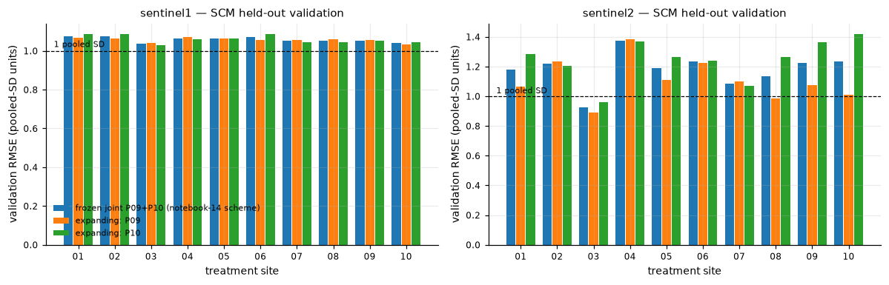
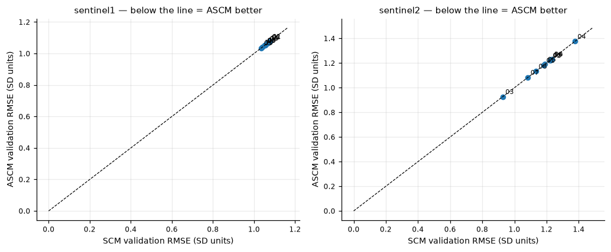
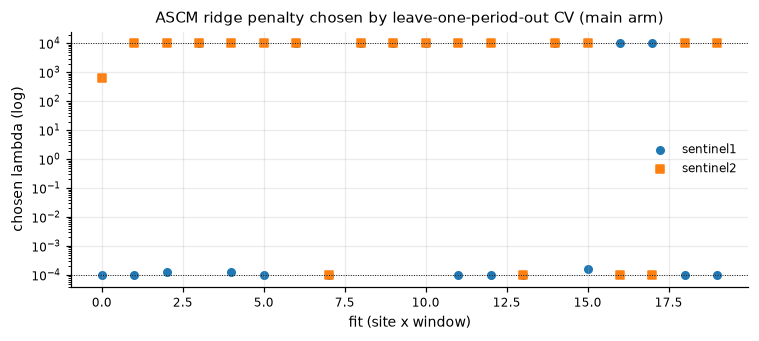
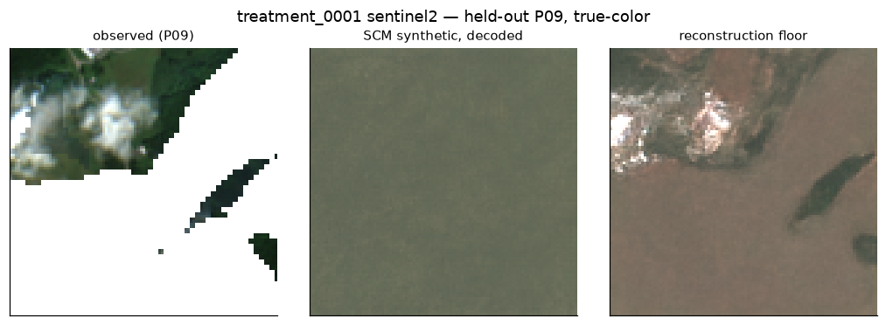
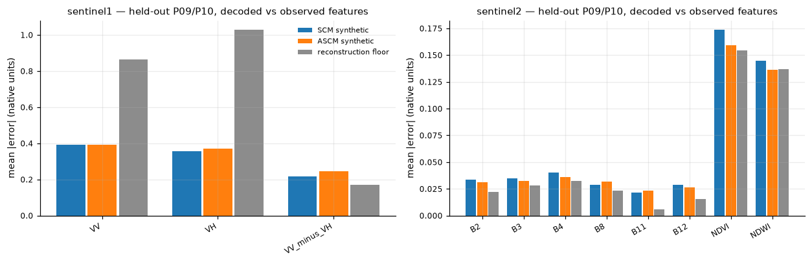
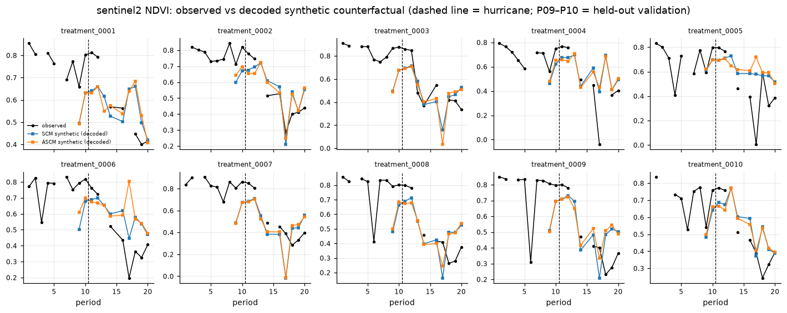

# Slide outline — latent SCM/ASCM on the biweekly panel

**Date:** 2026-08-21

**Open the slides in Cursor:** [8-21-SCM-ASCM](/home/grads/junh/.cursor/projects/data-wang-junh/canvases/8-21-SCM-ASCM.canvas.tsx)

That canvas opens beside the chat. “Open … figure” buttons load the PNGs from `notebooks/ts_SCM_ASCM/`. HTML copy (plots as files, for a real browser): [`Docs/8-21-SCM-ASCM.html`](8-21-SCM-ASCM.html).

**Change from the 11-slide draft:** former slide “why holdout is possible” is one sentence inside Design.

Numbers below are from the executed 2026-08-19 run. Paths are relative to `REAP/`.

| # | Slide | Main visual |
|---|---|---|
| 0 | Title | none |
| 1 | Design | pipeline + split table |
| 2 | Encode | availability table |
| 3 | kNN donors | distance table + overlap table (`panel_knn_donors.csv`) |
| 4 | Estimators and metric | RMSE formula |
| 5 | Result 1 — SCM | `panel_scm_validation.png` + RMSE table |
| 6 | Result 2 — ASCM | `panel_scm_vs_ascm.png`, `panel_ascm_lambda.png` |
| 7 | Result 3 — decode vs floor | `panel_decode_example.png`, `panel_decode_validation_features.png` |
| 8 | Effects, vs feature SCM | `panel_trajectories_sentinel2_NDVI.png` + notebook-14 table |
| 9 | Takeaway | none |

---

## 0. Title

Latent SCM/ASCM on the Helene biweekly panel.

Encode → kNN → SCM/ASCM weights → decode, scored on observed P09/P10.

Leave the audience line unlabeled.

---

## 1. Design

**Holdout sentence (former slide 1):** two-snapshot DiD could only compare pipelines; with 10 pre-hurricane periods, P09–P10 are still untreated, so the observed treated chip is ground truth.

Then the design:

- Sample: 10 treated × 50 controls with panel imagery × 2 sensors × 20 biweekly periods (Helene 2024-09-27).
- Chain: encode → kNN donors → SCM/ASCM in 980-d → decode.
- Split A (collaborator): fit P01–P08, freeze, score P09+P10.
- Split B (advisor): expanding window — P01–P08 → P09; P01–P09 → P10.

Notebooks: `notebooks/ts_SCM_ASCM/01_encode_biweekly_panel.ipynb` … `04_decode_holdout_groundtruth.ipynb`.

| | fit | score |
|---|---|---|
| frozen joint | P01–P08 | P09+P10 pooled |
| expanding | P01–P08 then P01–P09 | P09, then P10 |

---

## 2. Encode (notebook 01)

2,322 of 2,400 site–sensor–periods → TerraMind v1 quantized `(5,14,14)` = 980-d. Chip-mean NaN fill. P09/P10 complete for all 10 treated sites. S2 ~40% invalid pixels is a first-order caveat, not a detour.

**Table (from notebook 01 output):**

| sensor | before | after |
|---|---|---|
| Sentinel-1 | 588 / 600 | 559 / 600 |
| Sentinel-2 | 600 / 600 | 575 / 600 |

**Paths**

- Index: `notebooks/ts_SCM_ASCM/panel_latent_index.csv`
- Latents: `data/embeddings_tok_panel/latents_biweekly.npz`
- Manifest: `data/embeddings_tok_panel/manifest.json`

---

## 3. kNN donors and their distribution (notebook 02)

Lead with **distance** (it explains RMSE ≈ 1). Overlap with the covariate-matched 5 as a small table on the same slide.

- Search = every control **with panel imagery** (50), then keep 5 nearest per sensor. Distance = mean Euclidean distance of unscaled 980-d latents over shared P01–P08 periods.
- **Limit (not a filter):** `embed_DiD` searched 260 because those sites had snapshot chips. 210 of 260 have no P01–P20 GeoTIFF, so they have no latent. Repeating that search is new data. See `notebooks/ts_SCM_ASCM/README.md` § Limitation.

No kNN figure was saved. Use these tables (source: `notebooks/ts_SCM_ASCM/panel_knn_donors.csv`, main arm). Weights: `notebooks/ts_SCM_ASCM/panel_scm_weights.csv` (fit P01–P08).

**Latent distance of the 5 neighbors (unscaled 980-d)**

| sensor | min | median | max |
|---|---|---|---|
| Sentinel-1 | 12.66 | 13.09 | 13.28 |
| Sentinel-2 | 6.16 | 7.05 | 8.72 |

S1 is almost flat: “nearest” is not meaningfully nearer.

**Overlap with that site’s own 5 covariate-matched controls** (out of 5)

| site | S1 | S2 |
|---|---|---|
| 0001 | 0 | 1 |
| 0002 | 1 | 0 |
| 0003 | 1 | 1 |
| 0004 | 0 | 2 |
| 0005 | 1 | 0 |
| 0006 | 1 | 1 |
| 0007 | 1 | 1 |
| 0008 | 1 | 1 |
| 0009 | 1 | 2 |
| 0010 | 0 | 0 |
| **mean** | **0.7** | **0.9** |

Three sites per sensor have zero overlap.

**SCM weights on those 5 (preview of Result 1)**

| sensor | max weight (median) | effective donors (median) |
|---|---|---|
| Sentinel-1 | 0.21 | 4.98 |
| Sentinel-2 | 0.27 | 4.74 |

Nearly uniform. The simplex has nothing to prefer.

---

## 4. Estimators and the metric

Simplex SCM vs ridge ASCM (Ben-Michael et al. 2021). Same donors, same z-scoring, both splits.

\[
\mathrm{RMSE} = \sqrt{\mathrm{mean}\big((z_{\mathrm{treated}} - Xw)^2\big)}
\]

over periods × 980 z-scored latent dims. \(z\) uses the pooled 60-site, P01–P08 mean/SD, so **1.0 = 1 typical cross-site SD**.

- Training RMSE: fit window (in-sample).
- **Validation RMSE:** held-out P09/P10 — this is the result.
- Pass if validation RMSE < 1 **and** ratio (valid/train) ≲ 1.5.

---

## 5. Result 1 — SCM

Held-out RMSE sits on the 1-SD line. Train ≈ valid. Ratio 10/10 “good”; level fails almost everywhere. A 5-donor mix does not beat the site mean even in-sample.

**Plot**

Source table: `notebooks/ts_SCM_ASCM/panel_scm_validation.csv` (`arm=main`).

**Frozen joint (fit P01–P08 → P09+P10), main arm**

| site | S1 train | S1 valid | S1 level | S2 train | S2 valid | S2 level |
|---|---|---|---|---|---|---|
| 0001 | 1.082 | 1.077 | FAIL | 0.887 | 1.182 | FAIL |
| 0002 | 1.051 | 1.075 | FAIL | 0.836 | 1.221 | FAIL |
| 0003 | 1.030 | 1.035 | FAIL | 0.776 | **0.927** | pass |
| 0004 | 1.059 | 1.065 | FAIL | 1.001 | 1.376 | FAIL |
| 0005 | 1.053 | 1.064 | FAIL | 0.992 | 1.190 | FAIL |
| 0006 | 1.072 | 1.072 | FAIL | 0.915 | 1.232 | FAIL |
| 0007 | 1.051 | 1.051 | FAIL | 0.767 | 1.084 | FAIL |
| 0008 | 1.050 | 1.051 | FAIL | 0.863 | 1.134 | FAIL |
| 0009 | 1.049 | 1.054 | FAIL | 0.837 | 1.226 | FAIL |
| 0010 | 1.051 | 1.040 | FAIL | 1.015 | 1.232 | FAIL |

Only site 3 / S2 passes the level test. Expanding window is the same picture:

| | S1 valid RMSE | S2 valid RMSE |
|---|---|---|
| expanding P09 | 1.03–1.07 | 0.89–1.38 |
| expanding P10 | 1.03–1.09 | 0.96–1.42 |

Optional context plot (latent gap over P01–P20; do not treat post-period as a result): `notebooks/ts_SCM_ASCM/panel_scm_effect_trajectories.png`.

---

## 6. Result 2 — ASCM

Same validation RMSE. SCM vs ASCM lie on the diagonal (max |improvement| \(< 10^{-8}\)). No negative weights on main w8. 36/40 chosen \(\lambda\) sit on the CV grid boundary (13 at \(10^{-4}\), 23 at \(10^{4}\)). Ridge does not move the estimator.

**Plots**

**Paths**

- `notebooks/ts_SCM_ASCM/panel_scm_vs_ascm.csv`
- `notebooks/ts_SCM_ASCM/panel_ascm_lambda_cv.csv`
- `notebooks/ts_SCM_ASCM/panel_ascm_weights.csv`
- `notebooks/ts_SCM_ASCM/panel_ascm_validation.csv`

---

## 7. Result 3 — decode vs floor (notebook 04)

Two decoded images; they are not the same thing. Ground truth is always the **raw satellite chip**.

| | What is encoded | Donors? |
|---|---|---|
| **Synthetic counterfactual** | Weighted mix of the 5 donor latents at that period, then decode | yes |
| **Reconstruction floor** | The observed treated chip, encode→decode straight back | never |

If synthetic ≈ floor, the bottleneck is the decoder. If synthetic ≫ floor, the bottleneck is donors/weights.

**Plots**

Source: `notebooks/ts_SCM_ASCM/panel_decode_validation.csv` (mean |error| over 10 sites × P09/P10).

**Feature space (native units)**

| band | SCM | ASCM | floor |
|---|---|---|---|
| S1 VV (dB) | 0.39 | 0.39 | 0.87 |
| S1 VH (dB) | 0.36 | 0.37 | 1.03 |
| S2 NDVI | 0.174 | 0.159 | 0.154 |
| S2 NDWI | 0.145 | 0.136 | 0.137 |
| S2 B8 | 0.029 | 0.032 | 0.023 |
| S2 B11 | 0.021 | 0.024 | 0.006 |

S2 NDVI/NDWI ≈ floor → **decoder-limited**. S2 reflectance 1.1–3.6× floor → **donor-limited**. S1 chip-mean can beat the per-image floor (averages are easy); that is not spatial fidelity.

**Image-space RMSE (per-pixel, valid pixels only)**

| band | SCM | floor |
|---|---|---|
| S1 VV | 3.22 | 2.43 |
| S2 NDVI | 0.217 | 0.176 |

Per-pixel imagery is not usable either way. Latent-space RMSE after decode matches Result 1 (S1 1.06, S2 1.18) and is identical for SCM and ASCM.

---

## 8. Post-period effects, and vs feature SCM

Decoded P11–P20 means go in the vegetation-loss direction, but per-site SD > |mean|. Do not treat P11–P20 as a result.

**Plot**

Also: `notebooks/ts_SCM_ASCM/panel_trajectories_sentinel1_VV.png`. Table: `notebooks/ts_SCM_ASCM/panel_effect_features.csv` (method `scm`).

| band | mean effect | SD |
|---|---|---|
| S2 NDVI | −0.037 | 0.157 |
| S2 NDWI | −0.041 | 0.144 |
| S2 B8 | −0.040 | 0.048 |
| S1 VH (dB) | +0.26 | 0.91 |

Collaborator notebook 14 (chip-mean features, same split, different scaler) **passes** the 1-SD test that latent SCM fails. Failure is the 980-d spatial latent as the weighting space, not the holdout design.

Notebook-14 validation RMSE (P09–P10, their training-SD units) — from `Docs/report_new_panel_datasets_2026-08-19.md` §4.2:

| site | S1 | S2 | site | S1 | S2 |
|---|---|---|---|---|---|
| 0001 | 0.44 | 0.66 | 0006 | 0.43 | 0.52 |
| 0002 | 0.54 | 0.53 | 0007 | **0.72** | 0.45 |
| 0003 | 0.12 | 0.42 | 0008 | 0.19 | 0.52 |
| 0004 | 0.14 | **1.68** | 0009 | 0.18 | 0.42 |
| 0005 | 0.19 | **1.17** | 0010 | 0.07 | 0.29 |

S1 0.18–0.42 (site 7 poor); S2 0.43–0.78 (sites 4/5 poor). Different space and scaler: compare each pipeline only to **its own** 1-SD line.

---

## 9. Takeaway + what we would change

The panel solved evaluation. This encode→weight→decode chain does not produce a useful synthetic image.

Options (decisions, not defaults):

1. Fit weights on decoded features; keep the tokenizer for donor search / decode.
2. Spatially pool the latent before SCM.
3. Keep more than 5 neighbors from the existing 50.
4. Collect panel imagery for the other 210 of the 260 snapshot-era controls if we want that kNN back. New data, not a code change.

---

## Figure and table index

All under `notebooks/ts_SCM_ASCM/` unless noted.

| File | Used on slide |
|---|---|
| `panel_latent_index.csv` | 2 |
| `data/embeddings_tok_panel/latents_biweekly.npz` | 2 |
| `panel_knn_donors.csv` | 3 |
| `panel_scm_weights.csv` | 3 |
| `panel_scm_validation.csv` | 5 |
| `panel_scm_validation.png` | 5 |
| `panel_scm_effect_trajectories.png` | 5 (optional) |
| `panel_scm_vs_ascm.png` / `.csv` | 6 |
| `panel_ascm_lambda.png` / `panel_ascm_lambda_cv.csv` | 6 |
| `panel_decode_example.png` | 7 |
| `panel_decode_validation_features.png` | 7 |
| `panel_decode_validation.csv` | 7 |
| `panel_trajectories_sentinel2_NDVI.png` | 8 |
| `panel_trajectories_sentinel1_VV.png` | 8 |
| `panel_effect_features.csv` | 8 |
| `Docs/report_new_panel_datasets_2026-08-19.md` §4.2 | 8 (notebook-14 numbers) |
